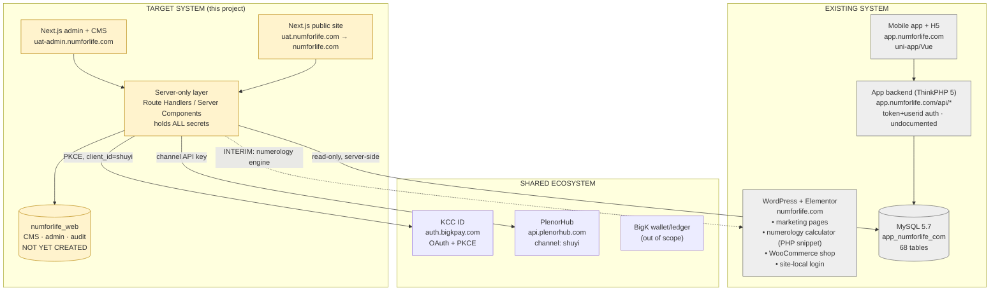

# NumForLife / 数易赋能 — Project Knowledge Handoff

**Purpose:** primary source of truth for continuing this project in a new AI/developer session.
**Written:** 2026-08-10 · **Branch:** `feat/production-foundation` · **HEAD:** `01165e0`

> **Read this first, then the PRD and the four API PDFs, then the repository.**
> This document explains and connects those sources — it does not replace them. Where this
> document and the repository disagree, **the repository is authoritative for implementation
> state**; the PRD, API docs and client decisions are authoritative for requirements.

### Scope notice — read before planning anything

The client's most recent messages materially narrowed and changed scope. Two things in
particular:

1. **Only numerology (数字生命) is confirmed.** Tarot was briefly in scope and has since been put
   back in question — see §12 and the Decision Log. Do not build Tarot yet.
2. **The agreed budget is USD 250.** The PRD describes a system worth many months of work
   (18 admin modules, full CMS, RBAC, audit, analytics, dashboards). Sections below faithfully
   record the PRD requirements, but treat them as the *long-term specification*, not the
   current committed deliverable. Confirm scope in writing before building large PRD sections.

---

# 1. Project Overview

**NumForLife / 数易赋能 ("Shuyi")** is a Chinese-language spiritual-wellness and personal-guidance
brand. It offers numerology (数字生命), name analysis (姓名学), tarot (塔罗), and Eastern divination
(东方占卜术 — 奇门遁甲 / 六壬), plus a membership programme and a small shop.

**Existing website** (`numforlife.com`) is WordPress + Elementor + WooCommerce. It serves marketing
pages, four service landing pages, a working numerology calculator, a WooCommerce shop, and
site-local login. It is being replaced.

**Existing mobile app** is the main product. Its web build is at `app.numforlife.com/h5/`
(uni-app/Vue). It holds the full experience: complete reports, saved records, membership,
energy points, mentors, daily almanac, and tarot.

**What we are rebuilding:** the public website as a Next.js/React/TypeScript/Tailwind application,
plus a website admin panel with a block-based CMS.

**Why:** move off Elementor/WordPress for maintainability, performance, SEO, API integration and
design control; the website is becoming product-driven rather than brochure-ware.

### Responsibility boundaries

| System | Owns |
|---|---|
| **Website (this project)** | Marketing, SEO, brand, simplified previews, membership explanation, conversion into the app |
| **Mobile app** | Full reports, saved history, deep interpretation, monetisation, retention |
| **KCC ID** (`auth.bigkpay.com`) | Identity, login, passwords, verification, SSO |
| **App backend** (`app.numforlife.com`, ThinkPHP) | Users, membership, orders, records, energy points |
| **PlenorHub** (`api.plenorhub.com`) | Products, SKUs, prices, inventory, merchants |
| **Website admin (this project)** | Website content, SEO, banners, redirects, display config, support lookup (read-only) |

**Core principle from the PRD:** the website attracts, educates, previews and converts. The app
retains, monetises and delivers the full experience. The website must remain deliberately limited.

---

# 2. Client / Contract Context

- Engagement is via Upwork. The client representative is **Soon**, who relays to the end client.
- **Before awarding the contract, the client asked for a frontend + admin/CMS demo** based on
  `numforlife.com`. That demo was built and deployed.
- **The client liked the demo**, said it closely matched the desired website, and then awarded the
  full project. Feedback was to improve **mobile alignment, attention to detail and overall design
  refinement**.
- **Therefore the demo is the approved visual/UX baseline.** Do not rebuild its look and feel
  without a strong technical reason. Refine rather than replace.
- The client asked for **periodic UAT releases** so feedback can be given piece by piece, rather
  than one delivery at the end.
- The client has shown sensitivity to **being asked too many questions**. Inspect the code,
  database, WordPress site and API docs before asking anything. Only ask what genuinely cannot be
  determined from available access.
- **Budget: USD 250**, with the client indicating further work depends on the relationship
  developing well ("future expansion plan"). Scope discipline matters more than completeness.

---

# 3. Client Requirements

Consolidated from the PRD, the API documents and later client clarifications. Items marked
**[CONFIRMED]** were explicitly confirmed by the client; **[PRD]** is specified but not
re-confirmed and may exceed current budget; **[SUPERSEDED]** has been overtaken by a later message.

## Public Website
- Homepage, about/brand, 测算 landing, calculation input + preview result, membership page,
  FAQ/SEO pages, legal pages, app download CTAs, responsive nav/footer **[PRD]**
- Shareable preview result pages **[PRD]**
- Limited website-generated calculation history **[PRD]**
- Lightweight user profile/dashboard **[PRD]**
- **Chinese only, no language switcher [CONFIRMED — project decision]**

## Admin Panel **[PRD — largely beyond current budget; confirm before building]**
Dashboard, page/content management, drag-and-drop CMS, SEO management, redirect management,
banner/announcement management, campaign management, media library, calculation/tarot preview
configuration, preview-record lookup, app download and deep-link management, user support lookup,
analytics/conversion reporting, feature flags, integration health monitoring, error/webhook
monitoring, admin role and permission management, audit logs.

## CMS **[PRD]**
Reusable content blocks; drag-and-drop or structured block editing; draft/published states;
preview before publishing; desktop/mobile preview; light/dark preview; scheduled publishing;
version history and rollback; SEO metadata per page; media library; page duplication and
archiving; approval workflow where practical. The PRD (admin appendix §3.3) lists 19 block types.

**Hard boundary:** the CMS controls content and presentation only. It must never control
calculation logic, tarot generation, authentication, membership entitlement, energy-point rules,
payment, user records or database operations.

## Authentication
- **Existing app users must be able to log into both the app and the website [CONFIRMED]**
- KCC ID is the identity system **[CONFIRMED]**
- Website must never manage passwords, phone/email verification or credentials **[PRD]**

## User Dashboard
- **May be built using the provided database access [CONFIRMED]**
- Show profile, membership status and expiry, credits/energy points, recent preview records,
  upgrade and open-app CTAs **[PRD]**
- Must remain limited; not a replacement for the app dashboard **[PRD]**
- **UX reference: `manutd.com` (patterns only — no branding, assets or copy) [CONFIRMED]**

## Numerology **[CONFIRMED — the one certain deliverable]**
- **There is no calculation API. The existing WordPress calculation must be rewritten/ported.**
- The current WordPress calculator is the behavioural source of truth.
- Do not change formulas without client approval.

## Tarot Lite **[SUPERSEDED — see §12]**
Briefly confirmed, then put back in question. Not currently buildable and not currently in scope.

## Membership
- Backend/app-admin is the source of truth; website displays only **[PRD]**
- Free / Elite / VIP tiers, benefits comparison, upgrade CTA, FAQ **[PRD]**
- **Membership affects PlenorHub product discounts [CONFIRMED]**

## PlenorHub / Products
- **WooCommerce is to be fully replaced by PlenorHub [CONFIRMED]**
- Website may control display and placement, never product data **[PRD]**
- **Purchase may complete on either website or mobile [CONFIRMED]**

## SEO **[PRD]**
Clean URLs, per-page title and meta description, canonical URLs, Open Graph, schema markup,
sitemap, robots.txt, H1/H2 structure, image alt text, image optimisation, Core Web Vitals,
redirects from all existing WordPress URLs.

## Analytics **[PRD]**
GA4; Meta and TikTok pixels if ads are used; backend event tracking. See §20 for the event list.

## Deep Links **[PRD]**
Managed store links and app deep links with UTM tracking. **The URI scheme has not been supplied.**

## Media **[PRD]**
Media library with upload, alt text, folders, replace/archive, file-type and size validation.

## Security **[PRD]**
HTTPS; no secrets client-side; no direct browser-to-database access; server-side input validation;
rate limiting; secure sessions; audit logs; protected admin routes.

## RBAC **[PRD]**
Six roles: Super Admin, Content Editor, Marketing Admin, Support Admin, Developer Admin,
Read-Only Admin. All permissions validated server-side, not merely hidden in the UI.

## Audit Logs **[PRD]**
Record admin actions with actor, role, module, target, before/after values, reason where required,
timestamp, IP and device. Read-only after creation.

## Integration Monitoring **[PRD]**
Health status for KCC ID, PlenorHub, backend APIs and analytics.

## Deployment
- **UAT public: `uat.numforlife.com` [CONFIRMED]**
- **UAT admin: `uat-admin.numforlife.com` [CONFIRMED]**
- **Production public: `numforlife.com` [CONFIRMED]**
- **Tencent Cloud → Lighthouse [CONFIRMED]**
- Production admin domain: **not confirmed — do not invent one.**

## Migration **[PRD]**
Audit current site, rebuild, redirect old URLs, validate, then decommission WordPress.

## Performance **[PRD]**
Fast first load, lazy images, optimised images, CDN caching, minimal JS, loading skeletons,
mobile-optimised animation.

## Responsive Design **[PRD + client feedback]**
Mobile-first across mobile, tablet and desktop. The client specifically asked for improved mobile
alignment and attention to detail.

## Light/Dark Mode **[PRD]**
Both modes required. Dark must be intentionally designed — deep navy/dark purple ground, soft card
surfaces, near-white primary text, soft grey secondary text, subtle gold or purple accent, gentle
glow only where appropriate. Not a colour inversion.

---

# 4. Resources & Access Provided by Client

### WordPress
- Site: `https://numforlife.com/`
- Admin pages list: `https://numforlife.com/wp-admin/edit.php?post_type=page`

Use it to inspect: existing pages and routes, published content, the working numerology calculator
at `/member-number-simulate/`, SEO URLs, WooCommerce products and shop behaviour, and any custom
snippets. **The numerology algorithm lives here and nowhere else** (see §11).

### Database / phpMyAdmin
- phpMyAdmin: `http://43.156.19.185:888/phpmyadmin_d9945283c1626bec/index.php?lang=en`
- Database: `app_numforlife_com` (MySQL 5.7)
- Direct MySQL on `43.156.19.185:3306` is reachable, so tooling can connect with a real client
  rather than scraping phpMyAdmin.

**Read-only credentials were supplied by the client in the Upwork/WhatsApp conversation. They are
deliberately NOT reproduced in this document.** Supply them at run time via environment variables
(`DB_HOST`, `DB_USER`, `DB_PASS`) — see `tools/db-inspect/README.md`. The account is read-only and
must stay read-only.

### Tencent Cloud
- Console: `https://console.tencentcloud.com/`
- Client instruction: use **Lighthouse**.
- Credentials were supplied by the client separately. **Current state: the supplied account is a
  sub-user without Lighthouse permission** — opening Instances returns
  `You are not authorized to perform operation 'DescribeInstances'` for
  `qcs::lighthouse:ap-singapore:uin/200034773819:instance/*`. This is outstanding (§26).

### UAT / Production
| Environment | Domain | Status |
|---|---|---|
| UAT public | `uat.numforlife.com` | **Does not resolve — not created** |
| UAT admin | `uat-admin.numforlife.com` | **Does not resolve — not created** |
| Production public | `numforlife.com` | Live WordPress |

DNS for `numforlife.com` is managed at **Porkbun** (nameservers `*.ns.porkbun.com`), *not* Tencent,
so the UAT subdomains cannot be created from the Tencent console.

### API Documents (place the PDFs in the project directory)
1. **`PRD_ Shuyi Website Frontend Revamp _ Enhancement.pdf`** — the product requirements document,
   including the Admin Panel appendix. Authoritative for requirements.
2. **`KCC-ID-API-Guide.pdf`** — central identity service. PKCE authorize/token, userinfo, sessions,
   2FA, OTP/registration, JWT claims. Used for website and admin login. Verified live (§10).
3. **`PlenorHub Commerce API Guide 2.0.pdf`** — product catalogue and commerce. `/integration/*`
   uses a channel API key; wallet endpoints use a KCC user JWT. Used for the shop (§13).
4. **`BigK-API-Guide 1.1.pdf`** — wallet/ledger/treasury/admin. **Almost entirely out of scope**
   for this website; relevant only if KCC coin balance is ever displayed.
5. **`KCC Platform & PlenorHub — Server Administration & Operations Guide.pdf`** — server layout
   for the KCC/PlenorHub box (`43.156.19.185`), deployment patterns, channel key management.
   Note it does **not** cover `app.numforlife.com` or the WordPress host.

### Other resources
- **Existing demo codebase** — this repository (see §6).
- **`IMPLEMENTATION-PLAN.md`** — the earlier living technical document with the full audit,
  evidence appendix and decision log D-001…D-016. Still useful; this handoff summarises it.
- **App backend** — `app.numforlife.com/api/*`, ThinkPHP 5, undocumented. Reverse-engineered
  endpoint list in §8/§9.
- **Tarot/Flutter source — NOT provided.** See §12.

---

# 5. Supporting Document Index

| Document | Purpose | Consult for | Authority |
|---|---|---|---|
| `PRD_ Shuyi Website Frontend Revamp _ Enhancement.pdf` | Full product spec + admin appendix | Any requirement question; acceptance criteria; block types; event list; role list | **Authoritative for requirements** |
| `KCC-ID-API-Guide.pdf` | Identity/auth | Login flow, PKCE, token claims, refresh, 2FA | Authoritative |
| `PlenorHub Commerce API Guide 2.0.pdf` | Products/commerce | Catalogue endpoints, channel keys, checkout, discounts | Authoritative |
| `BigK-API-Guide 1.1.pdf` | Wallet/ledger | Only if coin balance surfaces | Authoritative, low relevance |
| `KCC Platform & PlenorHub — Server Administration & Operations Guide.pdf` | Ops runbook | Server layout, deployment conventions, key rotation | Authoritative for the KCC box only |
| `IMPLEMENTATION-PLAN.md` (in repo) | Earlier audit + decision log | Evidence appendix, decision rationale D-001…D-016 | Superseded by this handoff where they differ |
| `PROJECT-KNOWLEDGE-HANDOFF.md` (this file) | Continuation guide | Everything else | Authoritative for *state and history*, not requirements |

**Conflict rule:** record the conflict, prefer the latest explicit client clarification, and never
silently alter the PRD. Known conflicts are listed in §22.

---

# 6. Existing Demo Codebase

**Stack:** Next.js **16.3.0** (App Router), React **19.2.8**, TypeScript, Tailwind **v4**,
`framer-motion` 13, `@dnd-kit` (core/sortable/utilities), `lucide-react`, `clsx`,
`tailwind-merge`, `server-only`.

> **Next.js 16 differs from older training data.** `middleware.ts` is deprecated → use `proxy.ts`.
> `cookies()` is **async**. `params` and `searchParams` are **Promises**.
> Always read `node_modules/next/dist/docs/` before writing framework code — the repo's
> `AGENTS.md` mandates this and it has already prevented two real bugs.

### Structure
```
app/           routes (public + admin)
components/    sections/ ui/ layout/ admin/ calc/ home/
lib/           cms/ calculators/ theme, visitor, rate-limit, legacy-redirects, content
tools/         calc-capture/ db-inspect/ plenorhub-check/   (dev tooling, not app code)
tests/         numerology-parity.mjs + fixtures/
proxy.ts       edge proxy: legacy redirects, canonical URLs, visitor id
```

### Classification

**KEEP / REUSE**
- `lib/animations.ts`, `lib/motion.ts` — motion vocabulary with reduced-motion support
- `components/ui/*` — `FadeIn`, `Button`, `Spinner`, `LoadingSkeleton`, `PageTransition`
- All `components/sections/*` and `components/sections/about/*` markup and animation — this is the
  client-approved design
- `components/admin/BlockEditor.tsx` — working dnd-kit block reordering
- `components/admin/ui/*` — admin design language

**REFINE**
- Sections still import static copy from `lib/content.ts`; they should take content from the CMS
  payload as the four already-converted ones do
- Mobile alignment and spacing throughout — this was the client's explicit feedback and has not
  yet been systematically addressed
- `components/admin/BlockForms.tsx` (386 lines) — bespoke forms per block; should become
  schema-driven when the CMS lands

**REPLACE FOR PRODUCTION**
- `lib/cms/content-provider.tsx` — localStorage CMS. Demo-only. Replace with DB-backed persistence
  behind `lib/cms/server.ts` (the seam already exists)
- `app/admin/login/page.tsx` — fake login (a `setTimeout` then redirect). Replace with KCC ID
- Images hot-linked from `numforlife.com/wp-content/**` — must move to our own media storage before
  WordPress is retired
- `EDITABLE_BLOCK_TYPES` in `lib/cms/types.ts` — only 4 of 10 block types are editable

**REMOVE**
- `temp-home.html` (365 KB scrape artefact) and the one-off `scripts/*.mjs` — **already removed**
- `tools/db-inspect/q*.mjs` — ad-hoc query scratch files, gitignored, safe to delete

**Technical debt / known limitations**
- Reading the theme cookie in the root layout makes every route dynamic (`ƒ`). Crawlers still get
  full HTML so SEO is fine, but static/ISR and CDN caching are lost. Reversible via a pre-paint
  inline script if mobile performance demands it.
- Rate-limit state is in-process: resets on deploy, does not span instances.
- No test runner is configured; tests are standalone Node scripts.
- No CI pipeline.

---

# 7. Existing WordPress System

**Stack:** `hello-elementor` theme + Elementor Pro, WooCommerce (+ WooCommerce Payments, PayPal),
`easy-login-woocommerce` (site-local accounts), `dark-mode-toggle`, **`code-snippets`**,
`filter-everything`, `safe-svg`, `pojo-accessibility`, `royal-elementor-addons`,
`happy-elementor-addons`, Jetpack, Google Site Kit.

### Page inventory (from `wp-sitemap-posts-page-1.xml` — 21 URLs)

| URL | Purpose | Disposition |
|---|---|---|
| `/` | Homepage | Rebuilt |
| `/about-us/` | Brand story, team, values | Rebuilt |
| `/portfolio/` | 产品服务 — four service tiles | Rebuilt |
| `/contact-us/` | Contact | Rebuilt |
| `/number/` | 数字生命 landing | **Redirects to `/celue/number`** |
| `/name/` | 姓名学 landing | **Redirects to `/celue`** |
| `/tarot/` | 塔罗占卜 landing (marketing only) | **Redirects to `/celue`** |
| `/eastern-divination/` | 东方占卜术 landing | **Redirects to `/celue`** |
| `/member-number-simulate/` | **The working calculator** | **Redirects to `/celue/number`** |
| `/membership/` | Membership — currently effectively empty | Pending |
| `/shopping/`, `/cart/`, `/checkout/`, `/view-order/` | WooCommerce | Pending (→ PlenorHub) |
| `/my-account/`, `/sign-up/` | Site-local auth | Pending (→ KCC ID) |
| `/privacy-policy/`, `/refund-policy/`, `/shipping-policy/`, `/accessibility-statement/`, `/使用条款/` (percent-encoded) | Legal | Pending |

Plus `wp-sitemap-posts-product-1.xml` (WooCommerce products) and a `product_cat` taxonomy sitemap.

### WooCommerce
Three live products, including **数易赋能App + 终生至尊会员 (VIP Lifetime) at $999**, plus a book
(~$19.99) and a T-shirt. Payment gateways are active. This is live revenue.

### After migration
**WordPress must not be removed until the replacement is validated.** It is currently also the
runtime engine for numerology (§11), so removing it would break the calculator. Keep it running
and firewalled as a rollback path for ~30 days after cutover.

---

# 8. Current System Architecture



**The one rule that governs the whole architecture:** the browser never holds a database
credential, an API key or a channel key, and never talks to MySQL. Everything goes through the
server-only layer.

---

# 9. Database Findings (`app_numforlife_com`)

MySQL 5.7.40 on `43.156.19.185:3306`. **68 tables.** Mapped with `tools/db-inspect/inspect.mjs`.
All inspection used aggregates, schema metadata and one field-shape sample. **No personal data was
extracted or committed, and `yzn_member.password`/`encrypt` were never read.** Keep it that way.

### Table → Columns → Feature

| Table | Rows | Key columns | Website feature |
|---|---|---|---|
| **`yzn_member`** | 51 | `id`, `username`, `nickname`, `email`, `mobile`, `avatar`, `sex`, `birth_time`, `year/month/day`, `twin_status`, `parent_year/month/day` | Dashboard profile; pre-fills the calculator |
| ″ identity | | `kcc_user_id`, `mall_client_id`, `mall_wallet_id`, `mall_bound`, `bigk_wallet_id`, `token` | Auth + KCC mapping |
| ″ membership | | `vip_level_id`, `vip_subscription_start`, `vip_subscription_end` *(NULL = lifetime)*, `vip_time`, `vip_price`, `overduedate`, `is_super`, `super_type` | Membership status, gating, discount tier |
| ″ credits | | **`coins`** (KCC Coin balance), `point`, `amount` | Energy-points card |
| `yzn_vip_levels` | 3 | `id`, `name` = 基础会员 / 精英会员 / 至尊会员 | Tier naming |
| `yzn_vip_fee` | 3 | `month_fee`, `year_fee`, `three_year_fee`, `five_year_fee`, `lifetime_fee`, `*_gift_coins`, `*_recommended` | Membership pricing |
| **`yzn_vip_purview`** | 9 | `purview_name`, `base/elitist/supreme_vip_key` + `_value` | Benefit table, **all gating**, **shop discount** |
| `yzn_vip_purview_user_use_info` | 103 | per-user entitlement consumption | Quota display |
| **`yzn_records`** | 1001 | `userid`, `records_type` (0 数字 / 1 姓名 / 2 塔罗), `type` (−1 正常 / 0 流年 / 1 流月 / 2 流日), `tarot_type`, `year/month/day`, `result`, `result0..7`, `status` | 测算记录 / dashboard history |
| `yzn_qimen_records` | 44 | `query_year/month/day/hour/minute`, `qimen_result` (JSON), `liuren_result` (JSON) | 东方占卜术 (future) |
| `yzn_order` / `yzn_order_log` | 199 / 42 | membership & purchase orders | Dashboard order history |
| `yzn_shop_order` | 4 | 商城订单 | Shop history |
| `yzn_coin_log` / `yzn_coin_config` | 134 / 7 | coin movements by `type` | Energy-point history |
| `yzn_member_token` | 44 | `token`, `user_id`, `expire_time` | Legacy session validation |
| `yzn_tutor` | 3 | mentor profiles | 导师 (not in PRD) |
| `yzn_ads` | 3 | `position`, `image_url`, `vip_show` | Banner slots |
| `yzn_daily_data` | 404 | 万年历 | Daily content widget |
| `yzn_phase3_event` | 94 | `userid`, `event`, `feature`, `add_time` | **Reusable for backend analytics** |
| `yzn_radical` (284), `yzn_maindesc` (90), `yzn_elements` (5), `yzn_name_profile_config` | | name-analysis support data | 姓名学 (future) |

### Key facts
- **Membership distribution:** 基础 40 · 精英 6 · 至尊 5.
- **Pricing:** Elite $4.99/mo → $34.99/5yr (+50–130 gift coins); Supreme $12.99/mo → $89.99/5yr
  (+120–320). Lifetime rows exist but are `0.00` — note WooCommerce sells a **$999 lifetime VIP**
  with no counterpart here.
- **Credits:** 43 of 51 members hold coins (max 1055, mean 44.5).
- **`yzn_records.result` is JSON:**
  `wuxing.p1..p8`, `wuxing.main_number`, `wuxing.secondary_number`, `wuxing.left1..3`,
  `wuxing.right1..3`, `mainwx`, `mainwxx`, **`fullOrder` (array[5])**, `list` (array[16]).
  769 of 821 numerology rows are JSON-encoded; older rows use a legacy format, so a port must
  tolerate both.
- **`fullOrder` independently confirms the rotating five-element order** discovered from the web
  calculator (§11).

### Data-flow architecture
```
Browser ──► Next.js Server Components / Route Handlers ──► MySQL (read-only, server-side)
   ▲                        │                          ──► app.numforlife.com API
   └── httpOnly cookie ─────┘                          ──► auth.bigkpay.com / api.plenorhub.com
        no DB creds, no API keys, no channel keys ever reach the browser
```

**The client explicitly confirmed the provided database access may be used to build the user
dashboard.** That is compatible with the PRD's "frontend must never connect directly to the
database": *frontend* means the browser. A server-side read from a Route Handler is not the
browser. Anything the website writes (CMS, admin, audit, preview records) goes into a **separate
schema (`numforlife_web`), never into `app_numforlife_com`.**

---

# 10. KCC ID Authentication

**What it is:** the ecosystem's central identity service at `https://auth.bigkpay.com`. It owns
identity, login, passwords, verification and SSO. The website must never manage credentials.

### Verified live (evidence from probing)
- Discovery works: `/.well-known/openid-configuration` and `/.well-known/jwks.json`.
- **Use `client_id=shuyi`.** Probing `/kccid/v1/authorize` with deliberately invalid credentials:
  - `client_id=numforlife` → `401 invalid_client` ("The client is not allowed") → **not registered**
  - `client_id=shuyi` → `401 invalid_grant` ("credentials are invalid") → **registered and accepted**
- **`/kccid/v1/authorize` is a non-redirect endpoint.** The server POSTs identifier + password +
  PKCE challenge and receives a `code` in the response body. **There is no browser redirect and
  therefore no callback/redirect URI to register** — so both `uat.numforlife.com` and
  `uat-admin.numforlife.com` work with the existing registration, with no KCC-side configuration.
- 2FA is enforced only for `bigk_wallet`; `shuyi` skips it and receives tokens directly.

### Intended flow
```
Browser → POST /api/auth/login (our server)
  1. generate PKCE verifier + S256 challenge, hold verifier server-side
  2. POST auth.bigkpay.com/kccid/v1/authorize {identifier, password, client_id: "shuyi",
     scope: "openid profile email", code_challenge, code_challenge_method: "S256"}
  3. POST /kccid/v1/token {grant_type: "authorization_code", code, client_id, code_verifier}
  4. store tokens in an ENCRYPTED httpOnly cookie — never exposed to JS
  5. refresh when < 5 minutes remain; honour token_version 401 by forcing logout
```
Rate limit: 5/min per IP on `/authorize` — surface a friendly 429.
Admin login uses the same flow, then maps the KCC `sub` to a local admin role (KCC does not store
our roles).

### The unresolved risk — read this before building auth
The client says existing app users can log into both. **The database shows only 8 of 51 members
have a `kcc_user_id`** (the same 8 are `mall_bound`; 0 have a `bigk_wallet_id`). The remaining 43
authenticate through the legacy `yzn_member.password` + `yzn_member_token` mechanism.

**A KCC-only login would exclude ~84% of the existing user base.** Three options:
(a) backfill the 43 into KCC before launch; (b) **dual-path — try KCC, fall back to legacy, link
`kcc_user_id` on first success (recommended)**; (c) KCC-only and accept re-registration.

Build auth behind a provider interface so either answer works without rework.

### Remaining unknowns
- Whether the client will choose (a), (b) or (c).
- Whether a real app-user credential authenticates via `shuyi` — answerable in one minute with one
  test account.
- Admin role storage: must be ours; the schema is not yet created.

---

# 11. Numerology Implementation

### Confirmed
**There is no calculation API. The client confirmed the existing WordPress calculation must be
rewritten/ported.** The current WordPress calculator is the **behavioural source of truth**.

### Where the logic lives
`https://numforlife.com/member-number-simulate/` — a self-POSTing PHP form injected into an
Elementor page via the **Code Snippets** plugin. Not in the app backend, not in any API.

### Inputs
| Field | Values |
|---|---|
| `date` | birth date (required) |
| `twin` | `y` / `n` (是否为双胞胎) |
| `big` | `big` / `small` (双胞胎顺序; only when `twin=y`) |
| `f-date` | father's DOB (only when `big=big`) |
| `m-date` | mother's DOB (only when `big=small`) |
| mode | submit button: `countbtn` 普通 · `type_day` 流日 · `type_month` 流月 · `type_year` 流年 |

### Outputs (three tabs)
1. **数字排列图** — SVG number pyramid, 3 stars, date decomposition (day, month, century, year),
   six derived digits
2. **主性格运势** — `N号人`, plus a five-column table over
   自身性格 / 子女财富 / 事业伴侣 / 官鬼疾病 / 父母贵人
3. **13组解析** — analysis groups (renders **12** buttons; 父基因, 母基因, 人生过程（父）,
   人生过程（母）, 子女下属, 近邻, 远亲, 当下朋友/事业, 人生过程（1）, 人生过程（2）,
   未来财富/健康/子女, 隐藏号)

### Two findings that would cause silent bugs
1. **The five-element order ROTATES per birth date.** It is a positional mapping onto the five
   categories, *not* a fixed 木火土金水 count. Four rotations observed: 木火土金水 (1990-05-12),
   火土金水木 (1999-12-31), 金水木火土 (2004-02-29), 水木火土金 (2015-09-21). Confirmed
   independently by `yzn_records.result.fullOrder[5]`.
2. **Group count varies by mode:** 12 for 普通/流日, 10 for 流月, 6 for 流年.

### Why the algorithm was NOT guessed
Testing the obvious rule — personality number = digital root of the birth date — it matches **7 of
9** non-twin fixtures but **fails `2000-01-01`** (rule predicts 4; production returns 9). One
counterexample in a small sample means unknown special-casing. A derived implementation would pass
our own tests and produce wrong readings in production, which in this product category is a trust
failure, not a cosmetic bug.

### Current implementation
`lib/calculators/numerology/engine-upstream.ts` calls the authoritative WordPress endpoint and
parses its HTML into a typed result. It sits behind a `CalculationEngine` interface, so swapping in
a native port is a one-line change in `lib/calculators/numerology/index.ts`.

`engine-cached.ts` wraps it with a 1-hour cache keyed on inputs (today's date folded in for the
relative modes) so repeatedly-opened shared links do not hammer the client's production WordPress.

### Regression strategy — already built
- `tools/calc-capture/capture.mjs` captured **12 golden-master fixtures** from live production into
  `tests/fixtures/numerology/production-baseline.json`, covering 7 base dates (leap day, year
  boundaries, single-digit month/day), twin-elder with father's DOB, twin-younger with mother's DOB,
  and all three alternate modes.
- `node tests/numerology-parity.mjs` runs the engine over every fixture and asserts each field.
  **Currently 12/12.**
- **This is the gate the native port must pass** before replacing the interim engine.

**Residual risk:** fixtures capture behaviour, not formulas. Inputs outside the matrix could still
diverge. Obtaining the PHP snippet (a two-minute export from the Code Snippets plugin) eliminates
this entirely. Do not change calculation behaviour without client approval.

### Gating
Driven by the real entitlement matrix, not invented rules: 主性格 and 五行总览 are 无限制 on every
tier, so they render fully; 81组数字 and 测算记录 cap at 首十个 (first 10) for the base tier.

---

# 12. Tarot Lite — NOT IN SCOPE / BLOCKED

**Status: do not build.**

Timeline:
1. Client initially deferred 姓名学 and 东方占卜术, keeping **numerology + tarot**.
2. Client then said: *"we may want to have numerology + 姓名学 + 东方占星学, instead of numerology +
   tarot"* and *"I let u know as soon as we have answers"*.
3. On being asked whether to proceed with numerology: **"Yes numerology for sure."**

So the second and third calculators are **undecided**, and tarot may be dropped entirely.

### What is known if it does return
- Tarot does **not** exist on the WordPress site (`/tarot/` is marketing copy only).
- The client says it exists in the mobile app; the PRD describes it as Flutter-based. The deployed
  H5 build is uni-app/Vue and contains **zero tarot routes** across both bundles.
- **The 8 spreads are known** from the `yzn_records.tarot_type` enum: `free`, `daily`, `love`,
  `one_card`, `yes_no`, `celtic_cross`, `tree_of_life`, `year_ahead`. Only 5 records exist, all
  `daily`.
- Tarot records share `yzn_records` with numerology (`records_type = 2`), so storage plumbing is
  shared.
- **No tarot deck, card or meaning table exists in any of the 68 database tables.** The artwork and
  interpretation text live inside the app binary.

**Blocked on:** the app/Flutter source or the card assets and interpretation content. Do not invent
card meanings, spreads or reading logic.

---

# 13. PlenorHub

**What it is:** the ecosystem's central product catalogue. Merchants manage a product once and
publish it to one or more channels (apps/storefronts).

### Confirmed client decisions
- **WooCommerce will be fully replaced by PlenorHub.**
- **Membership tier affects product discounts.**
- **Purchase may complete on either the website or the mobile app.**
- Merchants list prices in fiat and are not permitted to list in coin — client was checking why the
  API reports otherwise (see below).

### Channel — resolved
Use the **`shuyi`** channel. Evidence:
- `numforlife` channel: authenticates correctly (`meta.channel: "numforlife"`) but returned
  **0 products, 0 merchants, 0 categories** across repeated tests.
- After the client opted merchants in, **`shuyi` returned 1 product and 1 merchant**; `numforlife`
  remained empty.
- `shuyi` is also the KCC `client_id` that is registered, so identity and commerce resolve to the
  same tenant.

**Evidence was requested by Soon and supplied.** `tools/plenorhub-check/verify.mjs` regenerates a
screenshot-safe report (masked key fingerprints only) if it is ever needed again.

### Live catalogue state (last verified 2026-08-10)
Product id 95 — "Mapping Your Life Out of Boundaries", merchant "SK" (id 23),
`price: "10.00"`, `currency: "KCC"`, category `personal-services`, stock 99, image present,
description populated, merchant logo present.

### Open issues found by testing
| Issue | Detail |
|---|---|
| **Membership discount unsupported** | PlenorHub has no tier-discount concept. Its only discount is the KCC-wallet discount (`apply_kcc_discount`, `kcc_amount`, `can_apply_discount`), and checkout has **no field** for a channel/membership discount. So the 5%/10% must be applied by our layer, and enforcement at payment time is unresolved. |
| **Currency mismatch** | `/integration/*` returns `currency: "KCC"`; the client believes merchants list in fiat and says the item is US$10. Unresolved — **do not assume a 1:1 rate**. |
| **Categories empty** | Product reports `category: "personal-services"` but `category_id: null` and `/integration/categories` returns `[]`. Category browsing cannot be built yet. |
| **No fiat display price** | `/integration/*` returns KCC only; the `/app/*` family has `display_price` with conversion. |
| **No product deep link** | No URL field in the response. |
| **No variants** | `/integration/*` does not return variants. |

### Boundaries
PlenorHub remains source of truth for SKU, price, inventory, sellers and orders. The website admin
may control **display and placement only** — featured selection, order, hiding, labels, CTA
wording, page placement — never product data.

### Migration
`/shopping/`, `/product/*`, `/product-category/*`, `/cart/`, `/checkout/`, `/view-order/` all need
redirects once a shop page exists. Existing WooCommerce **orders and customer accounts have no
destination** in the new architecture — a data-retention decision the client still owes.

**Never store PlenorHub channel keys in this or any committed file.** They live in the API PDF and
should be supplied via environment variables; the guide documents rotation via
`channel:create-credential`.

---

# 14. Membership

**Source of truth:** the app admin / app backend. The website displays only; the website admin must
never modify tier, expiry, entitlement, credits or payment.

### Tiers (live data)
| id | Name | Members |
|---|---|---|
| 1 | 基础会员 (Basic) | 40 |
| 2 | 精英会员 (Elite) | 6 |
| 3 | 至尊会员 (Supreme/VIP) | 5 |

Pricing in `yzn_vip_fee`; expiry via `yzn_member.vip_subscription_end` (**NULL = lifetime**).

### Entitlement matrix — `yzn_vip_purview` (9 rows, also exposed publicly by the app API)
| id | 权限 | 基础 | 精英 | 至尊 | Website use |
|---|---|---|---|---|---|
| 1 | 广告 | 有 | 无 | 无 | Ad slots (ties to `yzn_ads.vip_show`) |
| 2 | 一次性赠品 | 无权 | 注册有礼* | 注册有礼* | Membership page |
| 3 | 主性格 | 无限制 | 无限制 | 无限制 | **Free on web** |
| 4 | 五行总览 | 无限制 | 无限制 | 无限制 | **Free on web** |
| 5 | 81组数字 | 首十个 | 无限制 | 无限制 | Gates the result page |
| 6 | 测算记录 | 首十个 | 无限制 | 无限制 | Gates 测算记录 |
| 9 | 免费一对一年度咨询 | 无权 | 无权 | 有权* | Membership page |
| 11 | 超级用户体验 | 无权 | 无权 | 有权* | Membership page |
| **17** | **商城优惠** | **0%** | **5%** | **10%** | **Shop discount** |

Value semantics: `999` = unlimited, `10` = first ten only, `−2` = no entitlement, `1` = granted.

**These percentages are read from the client's own production data — they were not invented.** The
client confirmed the discount is configured in the PHP database and the admin screenshot matches
(row 17 "Mall Discount" 0% / 5% / 10%).

**Read benefits and gating from this matrix at runtime; never hardcode them.** The PRD explicitly
forbids hardcoding membership rules, and this way admin changes flow through automatically.

**Contradiction to note:** WooCommerce sells a **$999 lifetime VIP** with no counterpart in
`yzn_vip_fee` (lifetime rows are `0.00`). Unresolved.

---

# 15. WooCommerce Migration

**Confirmed:** WooCommerce is to be fully replaced by PlenorHub.

| Old URL | Destination | Status |
|---|---|---|
| `/shopping/` | PlenorHub-backed shop | Pending — shop page not built |
| `/product/*`, `/product-category/*` | shop / product detail | Pending |
| `/cart/`, `/checkout/` | shop or PlenorHub checkout | Pending — checkout location unresolved |
| `/view-order/`, `/my-account/` | user dashboard | Pending — dashboard not built |

**Still needing investigation / client decision**
- What happens to existing WooCommerce **orders and customer accounts**.
- The **$999 Lifetime VIP** product — no equivalent in the app's membership pricing.
- Where checkout completes and who applies the 5%/10% discount at payment time.
- Whether payment gateways (WooCommerce Payments, PayPal) are retired or migrated.

**Confirmed vs unconfirmed:** the replacement decision is confirmed; every migration mechanic above
is not.

---

# 16. CMS Architecture

### Demo behaviour (to be replaced)
`lib/cms/content-provider.tsx` holds one `CMSContent` object in React context, persisted to
`localStorage["clientdemo-cms-content"]`, synced across tabs via the `storage` event. It is
demo-only: no server persistence, no drafts, no versioning, no scheduling, no media, single-page
editing, and content is invisible to crawlers and to other devices.

### Production approach — custom block CMS inside the Next.js app
Chosen because the client wants to **avoid recurring fees and vendor lock-in**, and because only
~3 of the PRD's 18 admin modules are CMS. A third-party CMS (Builder.io, Plasmic, Directus, Strapi)
would add a fee and a second system while leaving 15 modules to build anyway.

### Proposed schema (`numforlife_web` — separate from `app_numforlife_com`)
```
cms_pages(id, slug, title, template, status, published_version_id, scheduled_at, created_by, …)
cms_page_versions(id, page_id, version_no, blocks JSON, seo JSON,
                  state[draft|pending_approval|scheduled|published|archived], author_id, created_at)
cms_blocks_registry     -- server-side allow-list of block types + JSON Schema
cms_media(id, filename, url, mime, size, width, height, alt, folder, uploaded_by)
cms_navigation, cms_redirects, cms_banners, cms_campaigns, cms_announcements, cms_faq
admin_users(id, kcc_user_id, email, role, status)
admin_roles, admin_permissions
audit_logs(id, admin_id, action, module, target, before JSON, after JSON, reason, ip, ua, at)
site_settings(key, value JSON)   -- feature flags, deep links, CTA copy, disclaimers
preview_records(id, session_id, user_ref, type, input_hash, summary JSON, created_at)
```

**Versioning:** every save writes a new `cms_page_versions` row, so history and rollback come free.
`published_version_id` is what the public site reads. Scheduling flips it via a cron job and purges
the cache tag.

**The seam already exists:** `lib/cms/server.ts` → `getPublishedContent()`. It returns seeded
defaults today; pointing it at the database changes one file, not every page.

**Editor UX:** three panes — block list (reuse `BlockEditor`'s dnd-kit reordering), schema-driven
property form, live iframe preview with desktop/mobile and light/dark toggles.

**Hard boundary:** the block registry is a **server-side allow-list**. The CMS stores content only.
A custom-HTML block, if ever enabled, must be sanitised server-side and permission-gated.

---

# 17. Admin Panel

**Status: only the demo shell exists.** Everything below is PRD requirement, not built. Given the
budget, confirm scope before building this out.

Modules: dashboard · KCC ID login + RBAC · block CMS · page/content/SEO management ·
redirect manager · banner/campaign/announcement management · media library · user support lookup ·
payment/membership/credit read-only support view · membership display configuration ·
calculation preview configuration · preview-record management · PlenorHub display management ·
app download and deep-link management · analytics and conversion dashboard · feature flags ·
integration health monitoring · audit logs.

**Roles:** Super Admin, Content Editor, Marketing Admin, Support Admin, Developer Admin,
Read-Only Admin. **Permissions must be validated server-side in every route handler**, not merely
hidden in the UI.

### Must remain READ-ONLY (PRD ownership boundaries)
Membership tier and expiry · entitlement · energy points/credits and their rules · payment and
refunds · user credentials, password, phone/email verification · PlenorHub product data (SKU,
price, inventory, seller) · core calculation and tarot logic · audit logs after creation.

The website admin must never become a second source of truth for data owned by KCC ID, the app
admin, or PlenorHub.

---

# 18. UAT / Tencent Cloud Deployment

### Confirmed
- Public UAT `uat.numforlife.com`; admin UAT `uat-admin.numforlife.com`; production public
  `numforlife.com`. Production admin domain **not confirmed — do not invent one.**
- Platform: **Tencent Cloud Lighthouse**.

### Current state
| Item | State |
|---|---|
| Tencent console access | Credentials supplied, but the account is a **sub-user lacking Lighthouse permission** |
| Instance details (OS, Node, PHP, nginx, ports, paths) | **Unknown — could not be inspected** |
| `uat.numforlife.com` DNS | **Not created** |
| `uat-admin.numforlife.com` DNS | **Not created** |
| DNS provider | **Porkbun** (not Tencent) — subdomains cannot be created from the Tencent console |
| Deployment | **Nothing deployed** |

### Known from the Ops guide (the KCC box `43.156.19.185`, not necessarily the UAT box)
CentOS Stream 8 + aaPanel; nginx vhosts under `/www/server/panel/vhost/nginx/`; PHP 8.2 FPM;
PostgreSQL; Supervisor for workers; certbot for TLS. `app.numforlife.com` resolves to the **same**
IP, so the app backend, the APIs and the MySQL database are all on that box.

### Recommended architecture
```
uat.numforlife.com       → nginx vhost → 127.0.0.1:3000  (public Next.js)
uat-admin.numforlife.com → nginx vhost → 127.0.0.1:3001  (admin, noindex + IP allow-list)
```
Both can be served from **one Next.js app** using host-based routing in `proxy.ts` with the admin
in a route group — simpler and cheaper than a monorepo split, while still allowing nginx-level
restriction of the admin host. (An earlier plan proposed `apps/web` + `apps/admin`; the
single-app approach is the current recommendation given budget.)

Node 20 LTS, PM2, certbot TLS, nightly `numforlife_web` dumps, tagged releases for rollback.

### Environment variables (names only — never commit values)
`DB_HOST`, `DB_PORT`, `DB_USER`, `DB_PASS`, `DB_NAME`, `KCC_CLIENT_ID`, `PLENORHUB_CHANNEL_KEY`,
`NUMEROLOGY_UPSTREAM_URL`, `SESSION_SECRET`, `GA4_MEASUREMENT_ID`.
`.gitignore` already excludes `.env*`.

---

# 19. SEO & URL Migration

### Implemented
Legacy redirects live in **`proxy.ts`** via `lib/legacy-redirects.ts`, **not** `next.config.ts`.

**Why:** Next's built-in trailing-slash normalisation runs *before* both config redirects and the
proxy. WordPress serves every URL **with** a trailing slash, so config redirects made the common
case a two-hop chain (`/number/` → `/number` → `/celue/number`). `skipTrailingSlashRedirect: true`
hands that to the proxy, which resolves legacy URLs in **one hop** — and must then enforce the
canonical no-trailing-slash form itself, or every page would duplicate.

| Legacy URL | Destination | Verified |
|---|---|---|
| `/member-number-simulate` (+ `/`) | `/celue/number` | one hop |
| `/number` (+ `/`) | `/celue/number` | one hop |
| `/name`, `/tarot`, `/eastern-divination` (+ `/`) | `/celue` | one hop |
| `/about-us/` etc. | canonical no-slash | one hop |

Query strings (UTM/campaign) are preserved through redirects.

### Deliberately not yet redirected
`/membership`, `/my-account`, `/sign-up`, `/cart`, `/checkout`, `/view-order`, `/product/*`,
`/product-category/*`, and the legal pages including the percent-encoded `/使用条款/`.
**Redirecting them now would turn working pages into 404s.** They are listed in
`lib/legacy-redirects.ts` and land as destinations are built.

### Still to do
Per-page `generateMetadata`, canonical tags, OG/Twitter metadata and dynamic OG images, JSON-LD
(Organization, WebSite, FAQPage, BreadcrumbList, Product), `sitemap.ts`, `robots.ts`, image alt
audit, Search Console change-of-address, and a pre/post crawl diff before WordPress is retired.

---

# 20. Analytics

**Nothing is implemented yet.** No GA4 ID, Meta Pixel ID or TikTok Pixel ID has been supplied.

### Confirmed requirements (PRD)
GA4; Meta Pixel and TikTok Pixel if ads are used; backend event tracking for important product
events; conversion tracking for app download and open-app.

### Event list (PRD §16 + admin appendix §14.2)
Homepage visit · SEO page visit · 测算 page visit · calculation started · calculation submitted ·
result viewed · tarot page visit · tarot question entered · tarot card drawn · tarot result viewed ·
membership page viewed · upgrade CTA clicked · app download clicked · open app clicked ·
login clicked · KCC login success · KCC login failed · product viewed · product clicked ·
FAQ expanded · campaign banner clicked · record viewed · API error · dark mode toggled ·
form submission error · admin login · admin membership update · admin content update.

### Recommended (not required)
Reuse **`yzn_phase3_event`** (`userid`, `event`, `feature`, `add_time`) for backend event tracking
rather than building new infrastructure — it satisfies the PRD requirement and keeps website events
in the same stream as app events.

Pixels should sit behind consent flags.

---

# 21. Security Requirements

- **No database credentials or API secrets in client-side code, ever.** No browser-to-MySQL.
- Secrets only in server-side environment variables; `.env*` is gitignored; never commit values.
- The supplied database account is **read-only and must stay read-only**. Website writes go to a
  separate schema.
- HTTPS everywhere; HSTS; strict CSP.
- Tokens in **encrypted httpOnly cookies**; never in localStorage; SameSite=Lax; rotation on
  privilege change; idle and absolute timeouts; CSRF tokens on mutations.
- **Server-side validation on every input** — browser validation is a convenience, not a control.
  (`validateNumerologyInput` already follows this.)
- Rate limiting on login and calculation endpoints (calculation quotas implemented; see §23).
- RBAC enforced server-side in every route handler.
- Append-only audit logs with before/after, actor, IP, UA.
- Upload validation: MIME, size and magic bytes.
- Admin routes `noindex`, with an IP allow-list option.
- Calculation logic must never reach the browser bundle — enforced today with `server-only`.
- No personal data in logs, screenshots or committed files. Database inspection uses aggregates and
  schema metadata only.
- Production PlenorHub channel keys appear in a shared PDF and **should be rotated after handover**.

---

# 22. Client Decision Log

| # | Decision | Source | Impact |
|---|---|---|---|
| 1 | Demo accepted as the design direction; full project awarded | Client, pre-contract | Demo is the approved visual baseline |
| 2 | Improve mobile alignment, attention to detail, design refinement | Client feedback | Drives responsive work |
| 3 | Periodic UAT releases for piece-by-piece feedback | Soon | Ship continuously, not at the end |
| 4 | UAT public `uat.numforlife.com`, UAT admin `uat-admin.numforlife.com` | Soon | Two deployment entry points |
| 5 | Use Tencent Cloud Lighthouse | Soon | Deployment target |
| 6 | Existing app users log into both app and website via KCC ID | Soon | Auth strategy — but see the 8/51 coverage gap (§10) |
| 7 | Database access provided and may be used for the user dashboard | Soon | Server-side read-only data layer |
| 8 | **No calculation API; the WordPress calculation must be rewritten** | Soon | Port + regression strategy (§11) |
| 9 | Tarot should reference the mobile app implementation | Soon | Was in scope… |
| 10 | **Scope may become numerology + 姓名学 + 东方占星学 instead of numerology + tarot; answer pending. "Yes numerology for sure."** | Soon, latest | **Tarot no longer confirmed. Build numerology only.** |
| 11 | WooCommerce fully replaced by PlenorHub | Soon | Shop rebuild + redirects |
| 12 | Membership affects PlenorHub discounts | Soon | Tier-based pricing |
| 13 | Discount is configured in the PHP database | Soon | Found: `yzn_vip_purview` row 17 → 0/5/10% |
| 14 | Merchants list in fiat, not coin — client investigating why the API says KCC | Soon | Currency unresolved |
| 15 | Purchase may complete on website or mobile | Soon | Not app-only |
| 16 | PlenorHub should have products; send evidence if the channel is empty | Soon | Evidence supplied; `shuyi` now has 1 product |
| 17 | `manutd.com` as dashboard UX reference | Soon | Patterns only — no branding or assets |
| 18 | Plan should become reusable project knowledge documentation | Soon | This document |
| 19 | **Budget is USD 250; more depends on the relationship developing** | Soon | Scope discipline; MVP-first |
| 20 | Chinese only, no language switcher | Project decision | No i18n routing or per-locale CMS |
| 21 | Gamification (achievements, tasks, daily check-in, AI indices) excluded | Project decision | Present in the DB, absent from the PRD |
| 22 | Use PlenorHub channel `shuyi`; `numforlife` is empty and unregistered in KCC | Verified | Single tenant for identity + commerce |

### Recorded conflicts (not silently resolved)
- *"Retrieve from app database"* vs *"frontend must never connect directly to the database"* →
  resolved as browser ≠ server; server-side read-only layer (§9).
- *PRD says Flutter tarot* vs *deployed H5 is uni-app/Vue with no tarot* → unresolved (§12).
- *PRD says KCC ID is identity truth* vs *app backend uses its own token auth and only 8/51 members
  are KCC-linked* → unresolved, needs a client decision (§10).
- *Site tells users web results are never saved* vs *PRD wants saved preview records* → unresolved.
- *WooCommerce $999 lifetime VIP* vs *no lifetime pricing in `yzn_vip_fee`* → unresolved.
- *PlenorHub returns KCC currency* vs *client says merchants list fiat* → unresolved.

---

# 23. What Has Been Completed So Far

Verified against the repository, not inferred. Branch `feat/production-foundation`, HEAD `01165e0`,
working tree clean.

| # | Item | Status | Files | Notes |
|---|---|---|---|---|
| 1 | **Golden-master numerology fixtures** | **DONE** | `tools/calc-capture/capture.mjs`, `tests/fixtures/numerology/production-baseline.json` | 12 fixtures captured from live production; read-only, re-runnable. Surfaced the rotating five-element order and mode-varying group counts. |
| 2 | **Database schema map** | **DONE** | `tools/db-inspect/` | 68 tables mapped; aggregates only, no personal data. Credentials via env vars. |
| 3 | **PlenorHub verification tooling** | **DONE** | `tools/plenorhub-check/verify.mjs` | Screenshot-safe evidence with masked key fingerprints. |
| 4 | **Light/dark theme system** | **DONE** | `app/globals.css`, `lib/theme.ts`, `components/ui/ThemeToggle.tsx`, `app/layout.tsx` | Semantic tokens; light on bare `:root`, dark under both `prefers-color-scheme` and `[data-theme="dark"]`. Server-resolved from a cookie → no flash. Three-way toggle (浅色/深色/跟随系统). System CJK font stack rather than webfonting Chinese. |
| 5 | **Token migration of all components** | **DONE** | 20 components + all `app/` pages | Context-sensitive: `text-black` on `bg-accent` → `accent-fg`; white panels → `surface`. Partner logo plate and QR code deliberately stay white. |
| 6 | **SSR refactor** | **DONE** | `components/home/HomePageRenderer.tsx`, `lib/cms/server.ts`, `app/page.tsx`, 4 secondary pages | Homepage previously served a skeleton to crawlers. Verified: 57KB of HTML with hero copy and three `<h1>` tags, JS disabled. |
| 7 | **Pluggable calculator subsystem** | **DONE** | `lib/calculators/types.ts`, `registry.ts` | Type codes mirror `yzn_records.records_type`/`type`. 姓名学 registered as unavailable → "coming soon" card. |
| 8 | **Numerology engine (interim)** | **DONE** | `lib/calculators/numerology/{index,engine-upstream,engine-cached,parse}.ts` | Calls authoritative WordPress and parses output. `server-only`. Behind `CalculationEngine` so a native port is a one-line swap. |
| 9 | **Numerology parity suite** | **DONE** | `tests/numerology-parity.mjs` | **12/12 passing** against production, all fields. |
| 10 | **测算 pages** | **DONE** | `app/celue/page.tsx`, `app/celue/[slug]/page.tsx`, `app/celue/[slug]/result/page.tsx`, `components/calc/*` | Landing, form (GET → works without JS, shareable), server-rendered result. Gating from the real entitlement matrix. Results `noindex`. Verified: 1999-12-31 → 8号人, 火土金水木, 4,0,6,3,3. |
| 11 | **Calculation quotas + upstream protection** | **DONE** | `proxy.ts`, `lib/rate-limit.ts`, `lib/visitor.ts`, `engine-cached.ts` | 2/day anonymous quota matching production; 1-hour result cache. Verified: 2 succeed, 3rd blocked, different visitor unaffected. |
| 12 | **Navigation + legacy redirects** | **DONE** | `proxy.ts`, `lib/legacy-redirects.ts`, `next.config.ts`, `lib/content.ts` | 测算 in nav; single-hop redirects verified with and without trailing slash; UTM preserved. |
| 13 | **Knowledge documentation** | **DONE** | `IMPLEMENTATION-PLAN.md`, this file | Decision log D-001…D-016 plus evidence appendix. |

### Not started
CMS persistence · admin authentication · RBAC · audit logs · user dashboard · membership page ·
PlenorHub shop UI · SEO metadata/sitemap/robots/schema · analytics · deployment · Tarot.

---

# 24. Current Implementation State

- **Branch:** `feat/production-foundation` (9 commits ahead of `main`; `main` is the original demo)
- **HEAD:** `01165e0` — "Add 测算 navigation and single-hop WordPress redirects"
- **Working tree:** clean
- **Remote:** `https://github.com/KhaanFaizan/numforlife.git` — **configured but NOTHING PUSHED.**
  All work is local. Pushing is a decision for the developer/client.
- **Build:** `npx tsc --noEmit` clean; `npx next build` succeeds; all routes render server-side (`ƒ`)

### Routes working
`/` · `/about-us` · `/contact-us` · `/portfolio` · `/shopping` · `/celue` · `/celue/[slug]` ·
`/celue/[slug]/result`
**Admin (demo only, unauthenticated):** `/admin`, `/admin/dashboard`, `/admin/pages`,
`/admin/homepage`, `/admin/login`

### Integration state
| Area | State |
|---|---|
| Numerology | **Working** via interim upstream engine; parity 12/12 |
| Database | Inspected and mapped; **no runtime connection in the app yet** |
| KCC ID | Verified externally; **not integrated** |
| PlenorHub | Verified externally; **not integrated in the app** |
| CMS | localStorage demo; server seam exists but returns seeded defaults |
| Auth | **None** — admin login is fake |
| Tarot | **Not started, blocked** |
| UAT | **Not deployed** |

### Temporary / mock implementations to be aware of
1. Numerology engine proxies to WordPress (deliberate; see §11)
2. `lib/cms/server.ts` returns seeded defaults, not database content
3. Rate-limit state is in-process
4. `/admin/login` is fake
5. Images still hot-linked from `numforlife.com/wp-content/**`
6. `lib/content.ts` still holds static copy for most sections

### Known errors
None outstanding. One resolved worth remembering: `proxy.ts` importing a `server-only` module broke
`next dev` while `next build` passed. **A passing production build does not prove dev works** —
check both when touching `proxy.ts`.

---

# 25. What Remains To Be Done

## Immediate Next Tasks
1. **CMS persistence** — schema + repository + route handlers behind `lib/cms/server.ts`.
   *Priority: high. Dependency: a database (SQLite locally is fine to start).*
2. **Admin authentication via KCC ID** + session handling. *High. Depends on the auth decision (§10).*
3. **Per-page SEO metadata**, `sitemap.ts`, `robots.ts`. *High. No dependency.*
4. **Mobile refinement pass** across all sections — the client's explicit feedback. *High.*

## Public Website
Membership page (data-driven from `yzn_vip_fee`/`yzn_vip_purview`) · FAQ and SEO landing pages ·
legal pages (enabling their redirects) · homepage/section content moved into the CMS ·
media migration off `wp-content`.

## CMS
Block registry (PRD lists 19 types) · draft/publish/schedule · version history and rollback ·
media library · per-page SEO fields · banners/campaigns/announcements · approval workflow ·
light/dark and mobile preview.

## Admin
RBAC (6 roles, server-validated) · audit logs · redirect manager · user support lookup (read-only) ·
membership/payment/credit read-only views · PlenorHub display management · feature flags ·
integration health · analytics dashboard.
*All PRD scope — confirm against budget first.*

## Database
Create `numforlife_web` · repository layer for read-only `app_numforlife_com` access ·
move rate-limit state out of memory · preview-record storage (pending the policy decision).

## Authentication
KCC PKCE flow · encrypted httpOnly sessions · refresh + `token_version` handling · dual-path
legacy fallback and `kcc_user_id` linking · logout · admin role mapping.

## Numerology
Native port once the PHP snippet arrives (parity suite is the gate) · member-aware quota
(unlimited for logged-in members) · save-preview and share features.

## Tarot
**Blocked.** Do not start.

## PlenorHub
Shop listing and product detail · server-side tier-discount pricing · display/placement admin ·
WooCommerce redirects · resolve currency and checkout questions first.

## Membership
Membership page · dashboard membership card · upgrade CTAs · entitlement-driven gating helper
(`can(user, feature)`) shared by calculator, records and shop.

## SEO
Canonical tags · OG/Twitter + dynamic OG images · JSON-LD · remaining redirects · Search Console
change-of-address · pre/post crawl diff.

## Analytics
GA4 + consent-gated pixels · the event catalogue in §20 · optional `yzn_phase3_event` reuse.

## Testing
Test runner (Vitest) · component tests · Playwright journeys (calculator, auth, admin publish) ·
axe accessibility · Lighthouse budgets · CI pipeline.

## UAT
Tencent permissions · DNS for both subdomains · nginx vhosts · PM2 · TLS · env vars · first deploy.

## Production Migration
Full backup · DNS TTL reduction · cutover · 30-day WordPress standby · decommission only after
validation.

## Documentation
API integration doc · admin user guide · deployment notes · testing/SEO/security checklists ·
component documentation · permission matrix.

---

# 26. Remaining Blockers

## RESOLVED
- KCC client registration — **use `client_id=shuyi`**; non-redirect flow means no callback URLs to
  register, so both UAT domains work as-is.
- PlenorHub empty channel — `shuyi` now returns a product; evidence tooling exists.
- Database access — supplied, connected, 68 tables mapped.
- Membership discount rules — found in production data (0/5/10%).
- Calculation API existence — confirmed none; interim engine + parity suite in place.
- WooCommerce vs PlenorHub — full replacement confirmed.

## VERIFIED — ACTION REQUIRED
| Item | Why it matters | Ask |
|---|---|---|
| **KCC coverage decision** | Only 8/51 members have `kcc_user_id`; KCC-only login excludes ~84% of users | Choose (a) backfill, (b) dual-path *(recommended)*, or (c) KCC-only |
| **Numerology PHP snippet** | Removes all residual porting risk; parity suite is already the gate | Export from Code Snippets (~2 minutes) |
| **Checkout + discount enforcement** | PlenorHub cannot apply the 5%/10% | Where does checkout happen and who applies it? |
| **WooCommerce orders / $999 lifetime VIP** | No destination in the new architecture | Retain, migrate or archive? |
| **KCC vs fiat pricing** | API returns `currency: KCC`; client says fiat | Which is authoritative, and is there a fixed rate? |

## STILL BLOCKED
| Blocker | Affects | Workaround |
|---|---|---|
| **Tencent Lighthouse permissions** — sub-user lacks `DescribeInstances` | All deployment | None. Root account must grant Lighthouse access (view, WebShell, firewall). |
| **DNS for both UAT subdomains** — managed at Porkbun, not Tencent | All UAT review | None. Needs A records or Porkbun access. |
| **Tarot assets** — no deck, card meanings or spread content anywhere | Tarot only | Do not build. Scope is in question anyway (§12). |
| **PlenorHub categories/variants** | Category browsing, variant products | Build listing without category filters. |

## NON-BLOCKING / LATER
Deep-link URI scheme · GA4/Pixel IDs and Search Console access · brand assets (logo SVG, OG images,
approved CJK webfont) · preview-record policy decision · admin role assignments · scope ruling on
existing app features the PRD omits (mentors, 万年历, ads, 档案) · PlenorHub key rotation.

---

# 27. Next Implementation Sequence

Based on the actual repository state.

**Step 1 — CMS persistence.** Create the schema (SQLite locally is fine; `numforlife_web` on the
server later), a repository layer, and route handlers. Point `lib/cms/server.ts` at it. The seam
already exists, so this is contained.

**Step 2 — Admin authentication.** KCC PKCE behind a provider interface with a legacy fallback,
encrypted httpOnly sessions, replacing the fake login. Add the `admin_users` role mapping.

**Step 3 — Productionise the block editor.** Wire `BlockEditor` and `BlockForms` to the CMS API;
add draft/publish, version history and preview.

**Step 4 — SEO foundation.** `generateMetadata` per route, canonical, OG, `sitemap.ts`,
`robots.ts`, JSON-LD.

**Step 5 — Mobile refinement pass.** Systematically address the client's alignment and detail
feedback across every section. Highest visible value per hour.

**Step 6 — Membership page.** Data-driven from `yzn_vip_fee` + `yzn_vip_levels` +
`yzn_vip_purview` via a server-side read-only repository.

**Step 7 — User dashboard.** Profile, membership, credits, recent records. `manutd.com` for
patterns only.

**Step 8 — PlenorHub shop.** Listing + detail with server-side tier-discount pricing, once the
currency and checkout questions are answered.

**Step 9 — UAT deployment.** Once permissions and DNS exist.

**Step 10 — Remaining admin modules**, scoped against budget.

**Do first:** Step 1. It unblocks the admin promise and everything content-driven.

---

# 28. Important "Do Not" Rules

- **Do not rebuild the approved demo.** It is the client-approved baseline; refine, don't replace.
- **Do not expose database credentials or API secrets** in client-side code, logs, screenshots or
  documentation.
- **Do not commit secrets.** `.env*` is gitignored; keep it that way.
- **Do not connect the browser directly to MySQL.** All access is server-side.
- **Do not write to `app_numforlife_com`.** The account is read-only; keep it read-only. Website
  writes go to a separate schema.
- **Do not modify numerology behaviour without regression verification.** Run
  `node tests/numerology-parity.mjs` — it must stay 12/12.
- **Do not guess numerology formulas.** The obvious rule already fails a real case (§11).
- **Do not invent Tarot behaviour** — cards, meanings, spreads or reading logic.
- **Do not invent membership discount rules.** They come from `yzn_vip_purview`.
- **Do not hardcode membership benefits or gating.** Read the entitlement matrix at runtime.
- **Do not remove WordPress before migration is validated.** It is currently also the numerology
  engine.
- **Do not deploy to production.** UAT only, until the client signs off.
- **Do not make destructive database changes.**
- **Do not assume undocumented requirements.** If the PRD and a client message conflict, record it.
- **Do not ask the client questions answerable from the code, database, WordPress or API docs.**
  The client is sensitive to over-questioning.
- **Do not copy Manchester United branding, assets, copy or code.** `manutd.com` is a UX pattern
  reference only.
- **Do not redirect a live WordPress URL to a page that does not exist yet** — that turns a working
  page into a 404.
- **Do not trust a passing `next build` alone** when touching `proxy.ts` — verify `next dev` too.
- **Do not write framework code from memory.** Next.js 16 changed `middleware`→`proxy`, made
  `cookies()` async and `params`/`searchParams` Promises. Read `node_modules/next/dist/docs/`.
- **Do not extract or log personal data** from the database. Aggregates and schema only.

---

# 29. Cursor Startup Checklist

1. Read this entire document.
2. Read the PRD (`PRD_ Shuyi Website Frontend Revamp _ Enhancement.pdf`), including the Admin Panel
   appendix.
3. Read the four API PDFs — KCC ID, PlenorHub, BigK, Server Operations.
4. Read the client conversation export if present.
5. Read `IMPLEMENTATION-PLAN.md` in the repo for the evidence appendix and decision rationale.
6. Inspect the repository: `git log`, `git status`, the route list, `lib/`, `components/`, `tools/`.
7. Compare the repository against §23 and §25 here. **The repository wins on implementation state.**
8. Verify environment variable **names** exist without printing values.
9. Run `npx tsc --noEmit` and `npx next build` to confirm a clean baseline.
10. Run `node tests/numerology-parity.mjs` — expect 12/12.
11. Review the existing architecture before modifying anything.
12. Continue from **§27 Step 1 (CMS persistence)**.
13. Update this document whenever an architecture or client decision changes.

> **Do not blindly trust status information in this handoff if the repository contradicts it. The
> actual codebase is authoritative for implementation state, while the PRD, API documents and
> client decisions are authoritative for requirements.**

---

# 30. Final Notes

**Scope reality check.** The PRD describes a system far larger than the USD 250 budget. This
document records the full PRD faithfully so nothing is lost, but the committed deliverable should
be agreed explicitly. Numerology is the one confirmed calculator; tarot is in question; the admin
panel's 18 modules are aspirational at this budget.

**The single most valuable artefact in this repository** is
`tests/fixtures/numerology/production-baseline.json` together with `tests/numerology-parity.mjs`.
The numerology algorithm exists only inside a WordPress plugin that is scheduled for deletion. If
that plugin disappears before the snippet is exported, those 12 fixtures are the only record of how
the calculator behaves. Do not delete them, and re-run the capture harness if more coverage is ever
needed while WordPress is still alive.

**No secrets appear in this document.** Database credentials, PlenorHub channel keys, Tencent
logins and any tokens are referenced by location and purpose only, and must be supplied through
environment variables at run time.
